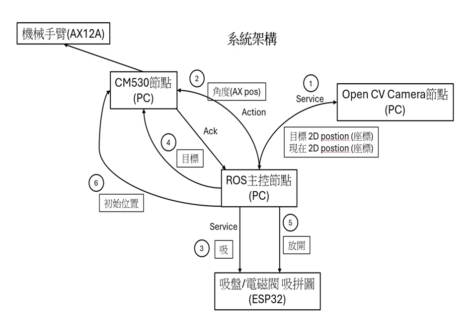

# CM530_ROS_BRIDGE

CM-530 與 ROS 對接韌體。ROS 計算 IK 並轉成 AX-12A position 整數；CM530 接收指令、發送馬達目標並回覆 ACK／ERR。

## 版本

- **[16 cm530 test](16%20cm530%20test/README.md)**：新增 A／B 雙手臂，同一塊 CM-530，由 ROS 每筆指定手臂。離線測試與 ARM 韌體建置已通過，附 CM530.hex／CM530.bin；實機待驗證。
- **[15 cm530 test](15%20cm530%20test/ROS_CM530_INTERFACE_SPEC.txt)**：保留原有單臂版本與燒錄檔；指令未帶 A／B，不能直接用於第 16 版。
- `12 CM530_BRIDGE_MODE`、`13 TEST`、`14 final test`：歷史 bridge、測試及除錯版本。
- `01` 到 `11` 與 `embeddec_c(cm530_v1_02) of`：SDK 範例與歷史來源。

## 雙手臂設定

| 由下到上 | A 手臂 ID | B 手臂 ID |
|---|---:|---:|
| j1 | 17 | 12 |
| j2 | 3 | 1 |
| j3 | 2 | 8 |
| j4 | 15 | 16 |

PC → CM530：單一序列埠，預設 COM4 @ 57600 / 8N1。
CM530 → AX-12A：共用 TTL bus，1 Mbps / Protocol 1.0。
Position：0..1023；HOME：四軸 512。

```text
ROS -> AX,A,520,512,512,512
CM530 -> OK,AX,A
ROS -> AX,B,520,512,512,512
CM530 -> OK,AX,B
```

ROS 必須逐筆核對回覆再送下一筆。ACK 代表目標封包已送出，不代表馬達到位。CM530 不計算 IK、不回讀位置；動作時間與雙臂協作順序由 ROS 安排。

建置、手動測試、完整命令及限制請看 [第 16 版操作說明](16%20cm530%20test/README.md)、[對接規格](16%20cm530%20test/ROS_CM530_INTERFACE_SPEC.txt) 與 [驗證紀錄](16%20cm530%20test/VALIDATION.md)。RoboPlus 僅用於燒錄與單機測試；ROS 使用序列埠時須關閉其他占用程式。

## 系統背景

原專案系統架構圖：



OpenCV 提供目標座標，ROS 計算手臂目標並安排動作，ESP32 負責吸盤／電磁閥。第 16 版擴充 CM530 的 A／B 路由介面，影像、IK、吸盤與任務協作仍由外部節點負責。

作者：xian1022
