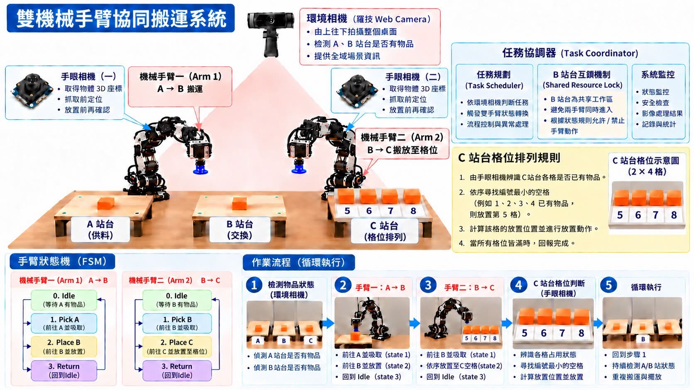

# 視覺導引雙臂協同搬運系統｜CM530_ROS_BRIDGE

**目前版本：第 17 版｜主機協定：5｜更新：2026-10-07**

手臂 1 執行 **A → B**，手臂 2 執行 **B → C**，C 區依最小編號空格排列，共 2 × 4 格。本儲存庫提供 CM-530 韌體、測試終端與 ROS 對接規格。

## 系統分工

| 模組 | 負責項目 |
|---|---|
| ROS 2／Orin | 三相機視覺、座標換算、運動規劃、雙臂狀態機、到位判斷、B 區互鎖及 C 區選格 |
| CM-530 | 接收 ROS 命令，執行四軸目標、HOME、位置回讀、HOLD、torque 與 LED 控制 |
| ESP32 | 吸盤控制，待整合驗證 |

## 搬運流程

1. 初始化後，由 ROS 要求雙臂返回 Home_A／Home_C，確認姿態。
2. 手臂 1 從 A 區取料，返回 Home_A 持物等待；B 區為空且取得使用權後放料。
3. 手臂 2 確認 C 區有空格及 B 區有料，取得 B 區使用權後取料；退回 Home_C 並確認離區後釋放使用權。
4. 手臂 2 選擇 C 區最小編號空格放置，確認結果並返回 Home_C。
5. C 區全滿時停止新增搬運、保留 B 區餘料；清臺並人工確認後重新辨識各區狀態。

**B 區一次只允許一臂使用；異常或離區尚未確認時維持鎖定。** 以下為整體系統流程，ROS 任務節點與吸盤整合不包含在本韌體內。

[開啟完整解析度流程圖](docs/images/dual-arm-flowchart.png)

## 第 17 版重點

- 保留雙臂 `AX`、`TORQUE`、`LED`，新增 `HOME`、`GET_HOME`、`READ`、`HOLD`。
- `home_A`、`home_C` 四關節暫設為 **512、512、512、512**，後續依機構校正。
- 開機不自動移動；ROS 明確下令並啟用 torque。
- **ACK 不等於到位**：ROS 使用位置回讀與視覺結果判斷下一階段。
- HOLD 讀完四軸後才寫入保持目標；讀取失敗回報異常，不寫入部分目標。

| 手臂 | j1 | j2 | j3 | j4 | HOME |
|---|---:|---:|---:|---:|---|
| arm1 | 17 | 3 | 2 | 15 | home_A |
| arm2 | 12 | 1 | 8 | 16 | home_C |

主機序列埠：**57600 baud、8N1**；馬達：**1 Mbps、DYNAMIXEL Protocol 1.0**。兩臂共用連線，命令逐筆發送並核對回覆。

## 目前進度

| 項目 | 狀態 |
|---|---|
| 第 17 版韌體、測試終端及對接文件 | 已完成 |
| Python 25 項、C 邏輯與 LED 測試 | 離線通過 |
| ARM 建置、HEX／BIN 一致性檢查 | 通過 |
| 第 17 版燒錄、HOME 校正、READ／HOLD 實機動作 | 待驗證 |
| 視覺、雙臂交接、B 區互鎖、八格排列及吸盤整合 | 待系統整合驗證 |

## 小組使用入口

| 用途 | 文件 |
|---|---|
| 指令、測試終端、建置與燒錄 | [第 17 版操作說明](17%20ROS%20to%20CM530%20ver.%20dual%20arm/README.md) |
| ROS 通訊串接 | [ROS–CM530 對接規格](17%20ROS%20to%20CM530%20ver.%20dual%20arm/ROS_CM530_INTERFACE_SPEC.txt) |
| HOME 位置調整 | [arm_config.h](17%20ROS%20to%20CM530%20ver.%20dual%20arm/APP/inc/arm_config.h) |
| 測試結果與實機驗收清單 | [VALIDATION.md](17%20ROS%20to%20CM530%20ver.%20dual%20arm/VALIDATION.md) |
| 程式分工 | [IMPLEMENTATION.md](17%20ROS%20to%20CM530%20ver.%20dual%20arm/IMPLEMENTATION.md) |
| 燒錄檔案 | [CM530.hex](17%20ROS%20to%20CM530%20ver.%20dual%20arm/CM530.hex)／[CM530.bin](17%20ROS%20to%20CM530%20ver.%20dual%20arm/CM530.bin) |

`01`～`11` 為原廠功能範例，`12`～`16` 保留歷史版本；目前開發與測試使用第 17 版。
