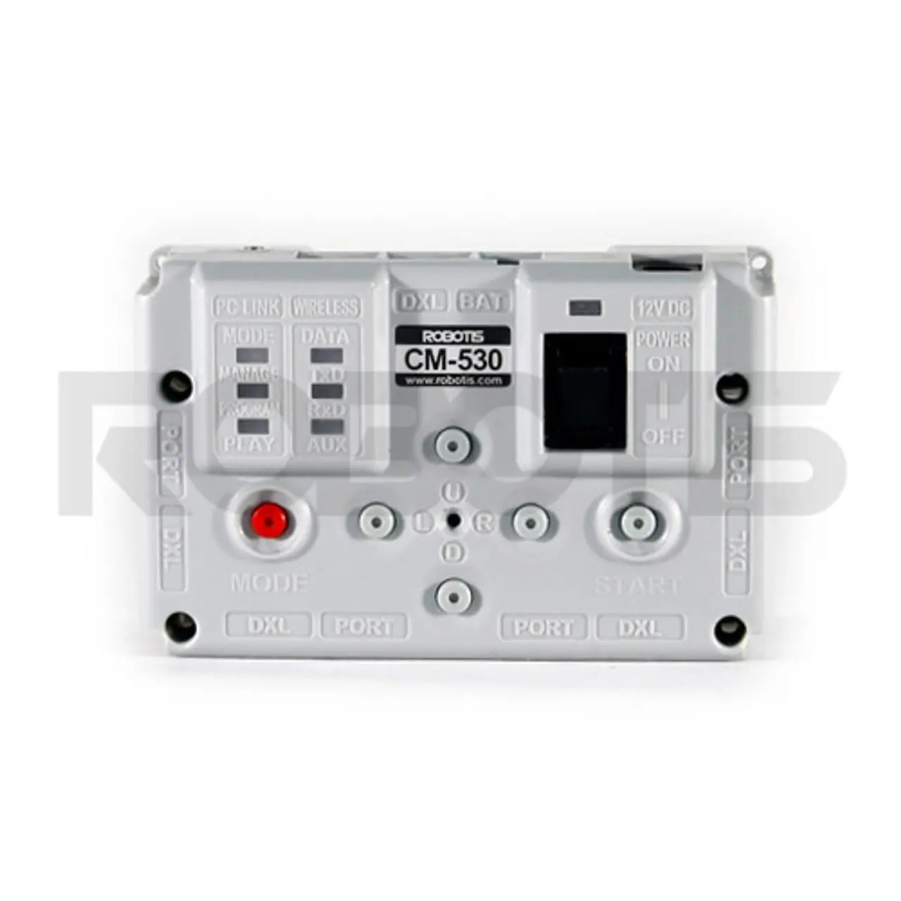

# CM530_ROS_BRIDGE：CM-530 雙臂馬達轉接韌體

本專案在 **CM-530 控制板**上執行自訂韌體，接收電腦傳來的文字指令，轉成 AX-12A 馬達使用的封包。一塊控制板管理兩支手臂，每臂四顆馬達，提供位置目標設定、馬達施力開關及板上紅綠燈控制。

這裡提供韌體原始碼、可燒錄的程式映像、手動測試終端、測試工具與 ROS 對接規格。閱讀本文件可以了解控制板怎麼接、指令怎麼下、回覆代表什麼，以及如何開始使用。ROS（機器人軟體框架）主機負責先算好目標，再交給控制板執行。

現行程式：[第 16 版 CM530 DUAL ARM](16%20CM530%20DUAL%20ARM/README.md)｜主機通訊協定：**4**｜文件更新：2026-10-01

## 閱讀導覽

- [1. 韌體提供哪些功能](#1-韌體提供哪些功能)：控制板收到指令後會做什麼。
- [2. 認識 CM-530 控制板](#2-認識-cm-530-控制板)：接頭、按鍵與燈號。
- [3. 指令如何送到兩支手臂](#3-指令如何送到兩支手臂)：馬達編號與通訊設定。
- [4. 看懂指令與回覆](#4-看懂指令與回覆)：中文解釋與操作原則。
- [5. 第一次使用的順序](#5-第一次使用的順序)：安裝與連線入口。
- [6. 常用術語對照](#6-常用術語對照)：英文與縮寫的意思。
- [7. 應用背景與系統圖](#7-應用背景與系統圖)：控制板在整體系統中的位置。
- [8. 文件版本與驗證狀態](#8-文件版本與驗證狀態)：完整文件與歷史版本。

## 1. 韌體提供哪些功能

韌體的工作路徑是：**接收文字指令 → 檢查參數 → 選擇手臂 → 傳送馬達封包或設定燈號 → 回覆結果。**

| 功能 | 控制板實際做的事 |
|---|---|
| 接收與檢查命令 | 檢查指令名稱、手臂名稱、欄位數及數值範圍，錯誤時回覆原因 |
| 選擇手臂 | 依 arm1／arm2 找到固定的四顆馬達 ID（裝置編號） |
| 設定四軸目標 | 將四個位置整數組成一筆馬達封包，寫入指定手臂 |
| 控制施力開關 | 接收明確的啟用／卸力指令；啟用前檢查是否已有有效目標 |
| 控制紅綠燈 | 依主機指令切換指定手臂的板上指示燈 |
| 回覆通訊結果 | 提供版本查詢、成功確認及錯誤回覆，供主機逐筆核對 |

韌體只接收已算好的位置，不計算運動路徑、不判斷到位，也不執行視覺辨識或吸盤控制。這些由主機及外部模組處理；本儲存庫提供它們與 CM-530 連線所需的介面規格。

## 2. 認識 CM-530 控制板

### 2.1 它在系統中的角色

CM-530 是 ROBOTIS 的機器人控制板，使用 STM32F103RE 微控制器。微控制器是執行韌體的小型處理器；「韌體」就是寫入控制板、開機後執行的程式。本專案用 C 語言程式接收主機指令，經控制板的 DYNAMIXEL 接口操作馬達。硬體與接頭資料可查閱 [ROBOTIS CM-530 官方手冊](https://emanual.robotis.com/docs/en/parts/controller/cm-530/)。



*圖 1：使用者提供的 CM-530 外觀參考圖。左右方向以此圖正面朝向為準；圖片中的亮燈不代表本版韌體的執行狀態。*

### 2.2 面板上的標示怎麼看

| 標示 | 中文解釋 | 在本專案中的用途 |
|---|---|---|
| PC LINK | 電腦連線端 | 使用相容通訊線連接電腦，收送文字指令 |
| DXL | DYNAMIXEL 馬達接口 | 連接 AX-12A；馬達可串接，共用通訊線 |
| BAT／12V DC | 電池／直流電源端 | 供電入口，須依硬體規格選用電源 |
| POWER／ON／OFF | 電源指示／開／關 | 辨識電源狀態與切換供電 |
| MANAGE／PROGRAM／PLAY | 管理／程式／執行標示 | 前兩顆改作 arm1 燈號，PLAY 熄滅 |
| TX（TxD）／RX（RxD）／AUX | 傳送／接收／輔助標示 | 前兩顆改作 arm2 燈號，AUX 熄滅 |
| MODE／START、U／L／D／R | 模式／開始、上／左／下／右按鍵 | 本版應用程式未提供按鍵搬運或停止功能 |
| WIRELESS／PORT | 無線模組／周邊接口 | 不使用於本版 ROS 命令或吸盤控制 |

面板名稱保留原廠印字，但本版應用程式重新指定燈號用途。原廠 RoboPlus 的模式操作方式，不能直接當成此自訂韌體的操作方式；開機載入程式（bootloader）階段也不在本版燈號規則範圍內。

電源與接線須同時符合控制板及馬達規格，不能只看面板的「12V DC」字樣判斷整套設備可用電壓。DXL 與 PC LINK 是不同用途的介面；不要把電腦的 RS-232 訊號直接接到馬達通訊線。接頭方向與電源腳位請依[官方接線說明](https://emanual.robotis.com/docs/en/parts/controller/cm-530/#pinout)核對。

### 2.3 本專案的紅綠燈規則

| 手臂 | 主機通知「動作中」：MOVING | 主機通知「停止／待命」：STOPPED |
|---|---|---|
| arm1，左欄 | MANAGE 綠燈，PB13 | PROGRAM 紅燈，PB14 |
| arm2，右欄 | TX 綠燈，PC14 | RX 紅燈，PC15 |

PB13 等名稱是微控制器的 GPIO（通用輸入／輸出）腳位代號，用來對照程式；操作終端時不需要輸入腳位。燈色依本專案確認的板子配置記載，實機驗收狀態見驗證紀錄。

應用韌體啟動後預設雙紅待命，每臂同時只亮一顆；PLAY、AUX 熄滅，POWER 維持原樣。ROS 準備執行動作時送 MOVING，依自己的完成判斷確認停止後再送 STOPPED。

**燈號顯示的是主機最後通知的狀態，不是馬達感測結果。** STOPPED 只切換燈號，不會停止馬達。位置與施力指令不自動改燈；示範結束、退出、錯誤或斷線也不自動改燈，因此斷線後可能保留舊顯示。

## 3. 指令如何送到兩支手臂

### 3.1 馬達編號與關節順序

每支手臂有四個控制關節，以 `j1`～`j4` 表示，沿用既有由下到上的順序。每顆 AX-12A 有一個唯一 ID（裝置編號），控制板依編號選擇馬達。

| 手臂名稱 | j1 | j2 | j3 | j4 |
|---|---:|---:|---:|---:|
| `arm1`：手臂 1 | 17 | 3 | 2 | 15 |
| `arm2`：手臂 2 | 12 | 1 | 8 | 16 |

八顆馬達共用 TTL bus（共用的馬達通訊線）。插在不同 DXL 接頭，不等於選了不同手臂；要由 arm1／arm2 對應的 ID 表決定。韌體不修改馬達 ID、EEPROM（斷電仍保存的設定）、速度或關節校正值。

### 3.2 有兩套不同的通訊協定

| 通訊路徑 | 本版設定 | 中文說明 |
|---|---|---|
| 電腦 ↔ CM-530 | 主機協定 **4**；57600 baud、8N1、無流量控制 | 用文字行下指令；8N1 表示 8 個資料位元、無同位檢查、1 個停止位元 |
| CM-530 → AX-12A | DYNAMIXEL Protocol **1.0**；1 Mbps | 控制板把文字命令轉成馬達使用的二進位封包 |

板內主機通訊使用 USART3，馬達通訊使用 USART1；USART 是微控制器的序列通訊硬體。主機協定升為 4，**不代表馬達要改成 Protocol 4**。

baud 是序列傳輸速率單位，Mbps 是每秒百萬位元。兩端速率不同，由控制板分別設定；電腦連線請使用 57600，不要套用馬達端的 1 Mbps。

ROS 需先將座標或角度換算成四個 `0～1023` 的整數。這是馬達位置的原始數值範圍，不代表組裝後每個關節都能走完整範圍；機械限制仍由 ROS 與操作者確認。

## 4. 看懂指令與回覆

### 4.1 指令表

指令使用半形英文字母、數字與逗號，每行一筆。arm1 可替換為 arm2；下表位置數值僅示範格式，**512 不是已校正的待機姿態，不能直接假定適合你的手臂**。

| 指令範例 | 中文意思 | 成功回覆 |
|---|---|---|
| `PING` | 確認控制板能否回應通訊 | `PONG` |
| `VERSION` | 查詢主機通訊協定版本 | `VERSION,4` |
| `AX,arm1,512,512,512,512` | 設定手臂 1 的 j1、j2、j3、j4 目標位置 | `OK,AX,arm1` |
| `TORQUE,arm1,0` | 關閉手臂 1 四顆馬達的施力輸出，俗稱卸力 | `OK,TORQUE,arm1,0` |
| `TORQUE,arm1,1` | 開啟手臂 1 四顆馬達的施力輸出，需先有有效目標 | `OK,TORQUE,arm1,1` |
| `LED,arm1,MOVING` | 將手臂 1 的指示燈設成動作中：綠亮、紅滅 | `OK,LED,arm1,MOVING` |
| `LED,arm1,STOPPED` | 將手臂 1 的指示燈設成停止／待命：紅亮、綠滅 | `OK,LED,arm1,STOPPED` |

AX 必須一次提供四個目標，不能只送 `AX,arm1,512`。TORQUE 在這裡是施力開關，不是調整力量大小或速度。SYNC_WRITE（同步寫入）表示用一個封包寫入指定四顆馬達，不表示四軸同時到位。

### 4.2 開機、設定目標與啟用施力

1. 開機只對兩臂各傳一次卸力封包，不送位置。兩筆本地傳送均成功後，控制板主動送出 `READY,4`（協定 4 啟動就緒）。
2. 主機核對版本與連線後，先送完整 AX 目標，等待成功回覆。
3. 再送 `TORQUE,arm1,1`，明確啟用該臂；AX 本身不會自動啟用施力。
4. 啟用後，後續 AX 可能立即使手臂移向新目標；發送間隔由主機安排。
5. 每次有效卸力命令都會清除該臂的目標資格。下次啟用前，必須重新成功設定完整目標。

若開機傳送失敗，會回 `ERR,INIT_FAILED`（初始化失敗），動作命令鎖定到重啟；仍可使用 PING、VERSION、LED。兩臂的目標資格彼此獨立。

### 4.3 成功回覆代表什麼？

**ACK（確認回覆）不是「手臂已完成動作」。** 馬達指令的 OK 與開機 READY 只代表控制板本地處理及封包傳送結果；LED 的 OK 表示 GPIO 已設定。它們不證明馬達已到位或實際已施力／卸力。

本版不讀回當前位置，也不提供 HOME（回預設位置）、HOLD（讀取當前位置後保持）、BEGIN/PT/END（舊軌跡指令）或 STOP。重送最後目標仍是要求前往該目標，不能代替當前位置保持；卸力也不是保持位置。本版不在斷線後自動停機或卸力。

### 4.4 終端顯示與錯誤處理

手動終端中的 `TX ->` 表示「電腦送出」，`RX <-` 表示「電腦收到」。這是畫面標記，不是要輸入的指令內容，也與板上已改用途的 TX／RX 燈不同。

正常 LED 命令與正確回覆會靜默處理：不列印收發紀錄，也不另外顯示燈號狀態；程式仍完整核對 ACK。LED 錯誤、逾時、錯配回覆或控制板重啟會顯示錯誤並停止後續發送。

所有命令共用**全域一問一答**：前一筆回覆確認完畢，才能送下一筆。不能讓兩個手臂程式各自直接寫入同一條連線。錯誤時不自動重送或追加卸力指令；詳細錯誤碼見[第 16 版操作說明](16%20CM530%20DUAL%20ARM/README.md)。

## 5. 第一次使用的順序

### 5.1 先準備硬體與韌體

1. 確認 CM-530、八顆 AX-12A、相容通訊線及供電已備妥，馬達 ID 與上表一致，馬達通訊速率已設為 1 Mbps。
2. 依[第 16 版 README](16%20CM530%20DUAL%20ARM/README.md)建置、檢查並燒錄韌體。燒錄是把程式映像寫入控制板，與執行 Python 終端是兩件事。
3. 確認實際手臂可用的四軸目標。第一次先驗收單臂，再做雙臂交替命令，最後才交給 ROS 流程控制。

### 5.2 在電腦開啟手動終端

以下是在 Windows PowerShell 執行的命令，起始位置為專案根目錄：

```powershell
cd "16 CM530 DUAL ARM"
python -m pip install -r requirements.txt
python manual_position_terminal.py --port COM4 --arm arm1
```

| 命令或參數 | 說明 |
|---|---|
| `cd "16 CM530 DUAL ARM"` | 切換到第 16 版資料夾；名稱有空白，因此加引號 |
| `python -m pip install -r requirements.txt` | 用 Python 的套件工具，依清單安裝終端需要的套件 |
| `python manual_position_terminal.py` | 啟動手動終端程式；不會替你燒錄韌體 |
| `--port COM4` | 指定電腦上的序列埠；請依 Windows 裝置管理員改成實際編號 |
| `--arm arm1` | 指定四數字快捷輸入與示範程式的手臂；不會禁止完整指令指定 arm2 |

主機需能使用 Python；通訊套件為 pyserial。終端會檢查 VERSION,4 與 PONG，預設每筆命令等待回覆最多 2 秒。重新開啟終端不等於重新啟動控制板，不能假設馬達已卸力。

ROS 與手動終端應輪流使用，不能同時占用控制板序列埠。進入終端後可輸入 `help` 看說明，輸入 `q` 離開；離開不會自動卸力或改燈。`demo` 是會啟用馬達的示範動作，執行前務必先讀第 16 版的數值與流程說明。

## 6. 常用術語對照

| 英文／縮寫 | 中文與本專案中的意思 |
|---|---|
| Firmware／Bridge | 韌體／轉接程式；在控制板上把主機指令轉為馬達封包 |
| Serial port／UART | 序列埠／序列收發介面；逐筆傳送資料的通訊方式 |
| Protocol／Packet | 協定／封包；雙方約定的資料格式／一次傳送的資料組合 |
| Goal Position | 目標位置；要求馬達前往的位置，不是讀回的目前位置 |
| Torque Enable | 施力啟用開關；1 開啟，0 關閉 |
| ACK／ERR | 確認回覆／錯誤回覆；成功通常以 OK 表示，錯誤以 ERR 開頭 |
| Timeout | 逾時；期限內沒有取得預期回覆，不代表設備一定沒動 |
| GPIO／LED | 通用輸入輸出腳位／發光二極體指示燈 |
| Build／Flash | 建置／燒錄；將原始碼編成映像／把映像寫進控制板 |

## 7. 應用背景與系統圖

本韌體用於雙臂搬運系統：手臂 1 負責 A → B，手臂 2 負責 B → C，C 站為 2 × 4 八格。ROS 與外部模組負責視覺、動作計算、雙臂協調與吸盤；CM-530 負責圖中兩支手臂的馬達指令轉接及板上燈號。


*圖 2：使用者提供的系統規劃，供理解韌體的應用情境。其他模組未包含在本儲存庫內。*

## 8. 文件版本與驗證狀態

### 8.1 依工作選擇文件

| 想做的事 | 文件 |
|---|---|
| 認識控制板、韌體功能與基本操作 | 本 README |
| 接線、建置、燒錄、使用終端 | [第 16 版 README](16%20CM530%20DUAL%20ARM/README.md) |
| 開發 ROS 端的通訊程式 | [ROS–CM530 對接規格](16%20CM530%20DUAL%20ARM/ROS_CM530_INTERFACE_SPEC.txt) |
| 理解程式修改與設計 | [實作說明](16%20CM530%20DUAL%20ARM/IMPLEMENTATION.md) |
| 查詢離線測試與待做的實機驗收 | [驗證紀錄](16%20CM530%20DUAL%20ARM/VALIDATION.md) |
| 核對交付映像是否相同 | [SHA256SUMS 雜湊清單](16%20CM530%20DUAL%20ARM/SHA256SUMS)；雜湊是用來比對檔案內容的摘要 |

### 8.2 目錄與版本差異

| 目錄 | 用途 |
|---|---|
| `16 CM530 DUAL ARM` | 現行雙臂直接轉接韌體，主機協定 4 |
| `15 cm530 test` | 歷史單臂版本及舊規格 |
| `12 CM530_BRIDGE_MODE`、`13 TEST`、`14 final test` | 歷史轉接及除錯版本 |
| `01`～`11` 開頭的目錄 | 硬體功能範例，例如 `01 LED` 的燈號控制 |
| `embeddec_c(cm530_v1_02) of` | 歷史 SDK（軟體開發套件）來源 |
| `docs/images` | 本文件使用的系統架構圖與控制板照片 |

「第 16 版」是專案目錄版本，「協定 4」是主機指令格式版本，兩者不同。較早的第 16 版協定 2 有 HOLD 與軌跡封裝；協定 3 已精簡成直接轉接，但沒有 LED 命令。舊客戶端必須升級，不自動降級或重新解釋舊指令。

現有離線測試、建置與映像檢查結果記錄於 VALIDATION；**實體燈色、接線及馬達動作仍待實機驗證**，不能以離線通過取代接板驗收。歷史 [image.png](image.png) 僅供追溯，現行架構以本文件、圖 2 與對接規格為準。

作者：xian1022
